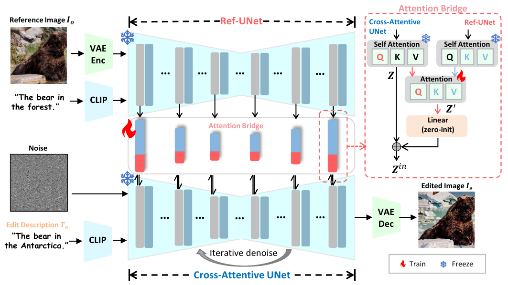
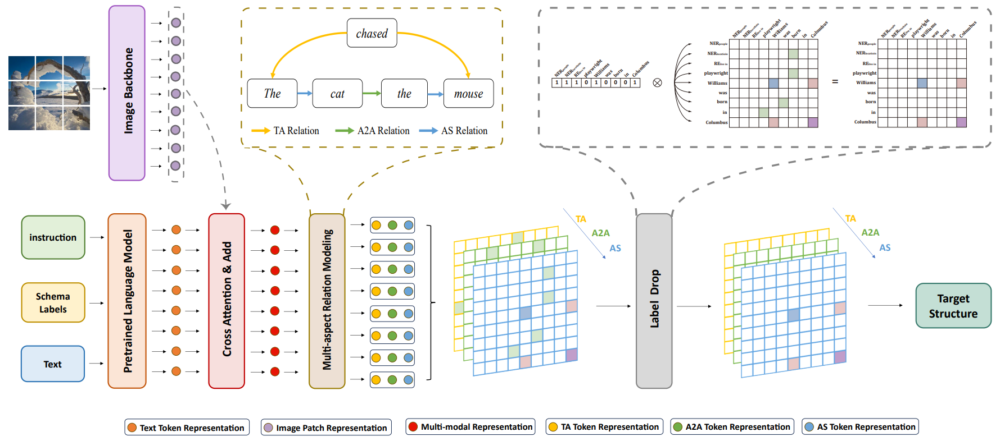
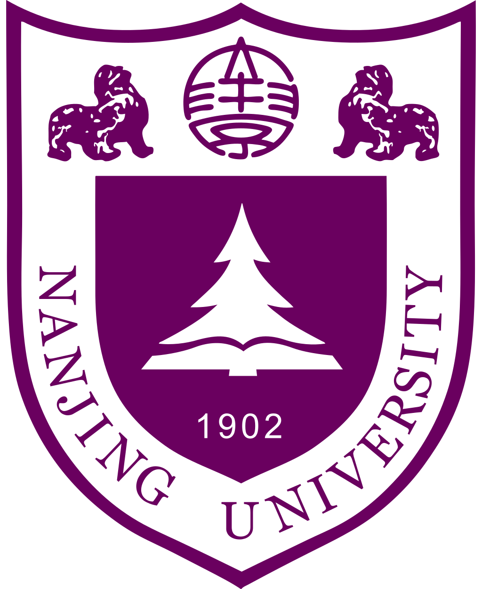
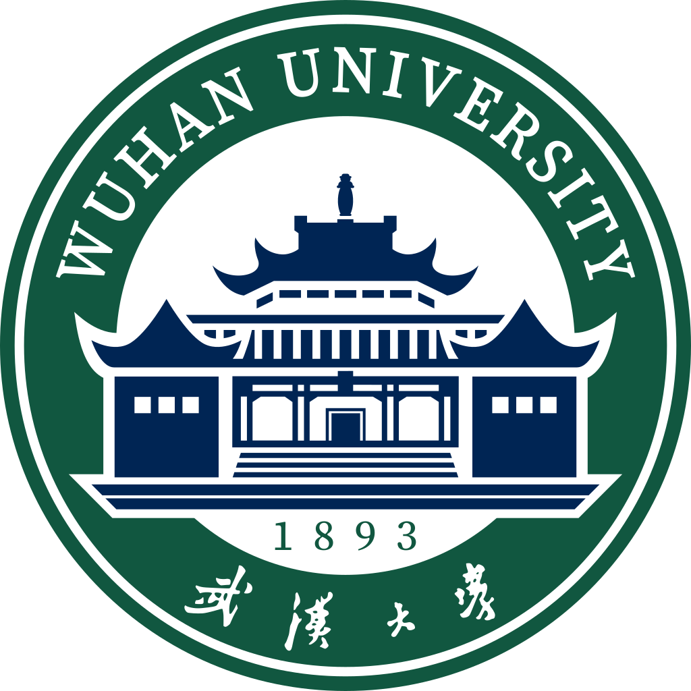








My name is En Ci, a CS M.S. student at Nanjing University, supervised by [Ying Tai](https://tyshiwo.github.io/). I obtained my B.S. degree at Wuhan University, advised by [Zuchao Li](https://zcli-charlie.github.io/). My current research interest centers on AIGC(AI-Generated-Content) and MLLM(Multimodal Lagre Lanuage Model), including image generation/editing, unified understanding and generation. 

<!-- I have published more than 100 papers at the top international AI conferences with total <a href='https://scholar.google.com/citations?user=DhtAFkwAAAAJ'>google scholar citations <strong>260000+</strong></a> (You can also use google scholar badge ). -->

# 🔥 News
<li><em>2025.09:</em> 🎉 One paper was accepted by <strong>NeurIPS 2025</strong>.</li>
<li><em>2025.09:</em> 🎉 Commenced my M.S. journey at <strong>Nanjing University</strong>, expecting three years of fruitful research.</li>
<li><em>2025.06:</em> 🎉 One paper was accepted by <strong>ICCV 2025</strong>. See you in Hawaii!</li>
<li><em>2025.06:</em> 🎈 Recognized as an <strong>Outstanding Graduate</strong> of Wuhan University. I am deeply grateful for the four enriching years spent here!</li>
<li><em>2025.01:</em> 🎉 One paper was accepted by <strong>NAACL 2025</strong>.</li>
<li><em>2024.11:</em> 🎈 I was honored with <strong>Lei Jun Scholarship(Undergraduate)</strong>.</li>
<li><em>2023.10:</em> 🎈 I was honored with <strong>the National Scholarship</strong>(0.2% nation-wide). </li>

# 📝 Publications 
**\* Equal Contribution**   

<dl>
  <dt>
NeurIPS 2025
</dt>
  <dd><a href="https://arxiv.org/abs/"><strong>UltraHR-100K: Enhancing UHR Image Synthesis with A Large-Scale High-Quality Dataset</strong></a></dd>
  <dd>Chen Zhao*, <strong>En Ci*</strong>, Yunzhe Xu*, Tiehan Fan, Shanyan Guan, Yanhao Ge, Jian Yang, Ying Tai</dd>
</dl>

<dl>
  <dt>
ICCV 2025
</dt>
  <dd><a href="https://arxiv.org/abs/2508.20505"><strong>Describe, Don't Dictate: Semantic Image Editing with Natural Language Intent</strong></a></dd>
  <dd><strong>En Ci*</strong>, Shanyan Guan*, Yanhao Ge, Yilin Zhang, Wei Li, Zhenyu Zhang, Jian Yang, Ying Tai</dd>
</dl>

<dl>
  <dt>
NAACL 2025
</dt>
  <dd><a href="https://arxiv.org/pdf/2502.12614"><strong>Label Drop for Multi-Aspect Relation Modeling in Universal Information
Extraction</strong></a></dd>
  <dd>Lu Yang, Jiajia Li, <strong>En Ci</strong>, Lefei Zhang, Zuchao Li, Ping Wang</dd>
</dl>

<!-- 

CVPR 2016

[Deep Residual Learning for Image Recognition](https://openaccess.thecvf.com/content_cvpr_2016/papers/He_Deep_Residual_Learning_CVPR_2016_paper.pdf)

**Kaiming He**, Xiangyu Zhang, Shaoqing Ren, Jian Sun

[**Project**](https://scholar.google.com/citations?view_op=view_citation&hl=zh-CN&user=DhtAFkwAAAAJ&citation_for_view=DhtAFkwAAAAJ:ALROH1vI_8AC) <strong></strong>
- Lorem ipsum dolor sit amet, consectetur adipiscing elit. Vivamus ornare aliquet ipsum, ac tempus justo dapibus sit amet. 

- [Lorem ipsum dolor sit amet, consectetur adipiscing elit. Vivamus ornare aliquet ipsum, ac tempus justo dapibus sit amet](https://github.com), A, B, C, **CVPR 2020** -->

<!-- # 🎖 Honors and Awards
- *2021.10* Lorem ipsum dolor sit amet, consectetur adipiscing elit. Vivamus ornare aliquet ipsum, ac tempus justo dapibus sit amet. 
- *2021.09* Lorem ipsum dolor sit amet, consectetur adipiscing elit. Vivamus ornare aliquet ipsum, ac tempus justo dapibus sit amet.  -->

# 📖 Educations

  

    

      <strong>2025.09 - Now</strong> 
      Master, Artificial Intelligence, Nanjing University 
    

  

  

    
  

  

    

      <strong>2021.09 - 2025.06</strong> 
      Bachelor, School of Computer Science, Wuhan University
    

  

  

    
  

<!-- # 💬 Invited Talks
- *2021.06*, Lorem ipsum dolor sit amet, consectetur adipiscing elit. Vivamus ornare aliquet ipsum, ac tempus justo dapibus sit amet. 
- *2021.03*, Lorem ipsum dolor sit amet, consectetur adipiscing elit. Vivamus ornare aliquet ipsum, ac tempus justo dapibus sit amet.  \| [\[video\]](https://github.com/) -->

# 💻 Internships

  

    

      <a href="https://vivo.com/">vivo, Shanghai</a>
    

    
Internship, Assistant Algorithm Engineer, 2024.10 ~ 

    <!-- 
Topics: (M)LLM, GUI Agent
 -->
  

  

    
  

    

